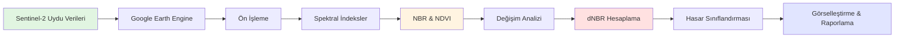
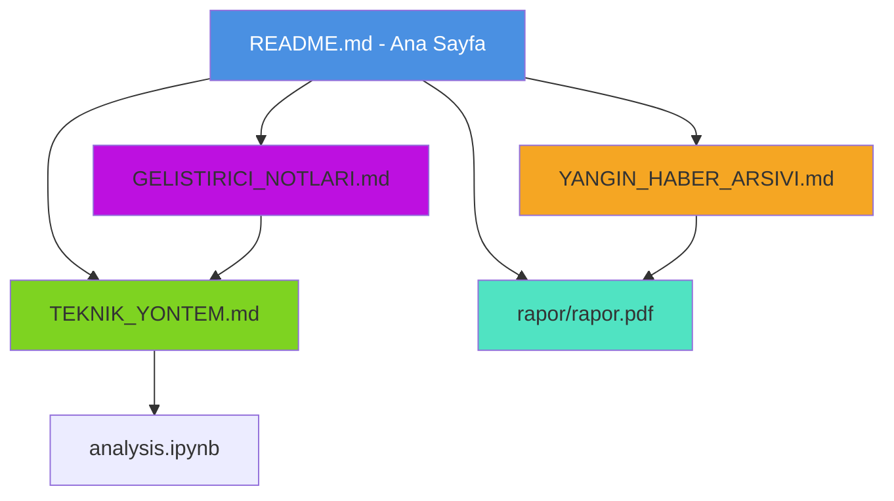

# Karabük 2025 Orman Yangınları Uzaktan Algılama Analizi


> **Sayısal Görüntü İşleme (Digital Image Processing) teknikleri kullanılarak, Sentinel-2 uydu görüntüleri üzerinden 2025 Karabük orman yangınlarının hasar tespit ve sınıflandırma çalışması.**


---

## 📌 Proje Hakkında

Bu proje, 2025 yaz sezonunda Karabük ilinde (özellikle Ovacık, Safranbolu ve Eflani bölgelerinde) meydana gelen orman yangınlarının çevresel etkilerini **sayısal yöntemlerle** analiz etmek için geliştirilmiştir. **Google Earth Engine (GEE) Python API** kullanılarak, yangın öncesi ve sonrası uydu görüntüleri işlenmiş ve **dNBR (Normalized Burn Ratio Difference)** algoritması ile hasar şiddeti haritalanmıştır.

Çalışma, geleneksel haber takibinin ötesine geçerek, yangın izlerini piksel tabanlı matematiksel modellerle doğrulamayı ve mühendislik yaklaşımıyla raporlamayı hedefler.

### 🔬 Teknik Özellikler
*   **Veri Seti:** Sentinel-2 L2A (10m Çözünürlük, Atmosferik Düzeltilmiş).
*   **İndeksler:**
    *   **dNBR:** Yanmış alan tespiti ve şiddet sınıflandırması.
    *   **dNDVI:** Vejetasyon sağlığı ve klorofil kaybı analizi.
*   **Filtreleme:** Bulut maskeleme, su maskeleme (Water Mask) ve gürültü giderme (Median Filtering).
*   **Referans Veriler:** Basın açıklamarı ve yerel haber kaynakları.

---

## 🔄 Proje İş Akışı



---

## 📚 Dokümantasyon ve Raporlar

Bu projenin teknik detayları, akademik raporu ve veri doğrulama kayıtları `dokumanlar/` klasöründe titizlikle arşivlenmiştir.

### 📖 Teknik Dokümantasyon

| Dosya | İçerik ve Açıklama |
| :--- | :--- |
| 📄 **[TEKNIK_YONTEM.md](dokumanlar/TEKNIK_YONTEM.md)** | **Metodoloji ve Algoritmalar** - Sentinel-2 veri işleme, NBR/NDVI formülleri, dNBR hesaplama yöntemi, USGS sınıflandırma standartları ve gürültü azaltma teknikleri. |
| 📰 **[YANGIN_HABER_ARSIVI.md](dokumanlar/YANGIN_HABER_ARSIVI.md)** | **Olay Kronolojisi ve Kaynaklar** - Yangınların zaman çizelgesi, basın açıklamaları, resmi istatistikler ve referans kaynaklar. Analiz sonuçlarının doğrulanması için kullanılan sözel veri seti. |
| 🛠️ **[GELISTIRICI_NOTLARI.md](dokumanlar/GELISTIRICI_NOTLARI.md)** | **Teknik Zorluklar ve Çözümler** - GEE API kısıtlamaları, bellek optimizasyonu, Python vs JavaScript karşılaştırması, görselleştirme sorunları ve gelecek projeler için öneriler. |

### 📊 Sonuçlar ve Çıktılar

| Kaynak | Açıklama |
| :--- | :--- |
| 🎓 **[rapor/rapor.pdf](rapor/rapor.pdf)** | Akademik formatta hazırlanmış **Nihai Proje Raporu** - Metodoloji, bulgular, hasar haritaları ve sonuç değerlendirmesi. |
| 🌐 **[index.html](index.html)** | İnteraktif web arayüzü - Tüm yangın bölgeleri için hasar haritaları, istatistikler ve görselleştirmeler. |
| 📁 **[sonuclar/](sonuclar/)** | Analiz çıktıları - Her yangın bölgesi için HTML haritaları ve PNG görüntüleri. |

### 🗺️ Dokümantasyon Haritası



---

## 🚀 Kurulum ve Kullanım

Kendi bilgisayarınızda bu analizleri tekrar etmek için aşağıdaki adımları izleyebilirsiniz.

### Ön Hazırlık
*   Python 3.8 veya üzeri yüklü olmalıdır.
*   Aktif bir [Google Earth Engine](https://earthengine.google.com/) hesabı gereklidir.

### 1. Projeyi Klonlayın
```bash
git clone https://github.com/yusufarbc/karabuk-2025-sentinel2-yangin-analizi.git
cd karabuk-2025-sentinel2-yangin-analizi
```

### 2. Sanal Ortam Oluşturun (Önerilen)
```bash
python -m venv .venv
# Windows için:
.venv\Scripts\activate
# Linux/Mac için:
source .venv/bin/activate
```

### 3. Bağımlılıkları Yükleyin
```bash
pip install -r requirements.txt
```

### 4. GEE Yetkilendirmesi
Analiz scriptlerinin uydu verilerine erişebilmesi için giriş yapın:
```bash
earthengine authenticate
```

### 5. Analizi Başlatın
Jupyter Notebook üzerinden adım adım ilerleyebilirsiniz:
```bash
jupyter notebook analysis.ipynb
```

---

## 📝 Lisans ve İletişim

Bu proje **MIT Lisansı** ile sunulmuştur. Akademik ve eğitim amaçlı kullanıma açıktır.

**Geliştirici:** Yusuf Talha ARABACI - *Karabük Üniversitesi*
