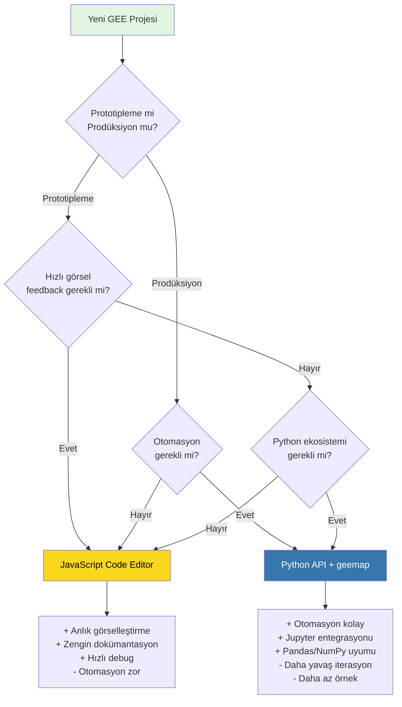

# GELİŞTİRİCİ NOTLARI VE OPTİMİZASYON GÜNLÜĞÜ

> 📍 **Navigasyon:** [Ana Sayfa](../README.md) | [Teknik Yöntem](TEKNIK_YONTEM.md) | [Haber Arşivi](YANGIN_HABER_ARSIVI.md)

---

## 📑 İçindekiler

1. [Giriş](#-giriş)
2. [Google Earth Engine Altyapı ve Planlama](#1-google-earth-engine-gee-altyapı-ve-planlama)
3. [Görselleştirme ve Sunum](#2-görselleştirme-ve-sunum-github-pages-entegrasyonu)
4. [Yönetim ve Kimlik Doğrulama Süreçleri](#3-yönetim-ve-kimlik-doğrulama-süreçleri)
5. [GEE API Seçim Karar Ağacı](#4-gee-api-seçim-karar-ağacı)
6. [Sorun Giderme Rehberi](#5-sorun-giderme-rehberi)
7. [Gelecek Projeler İçin Tavsiyeler](#6-gelecek-projeler-i̇çin-tavsiyeler)
8. [İlgili Dokümantasyon](#7-i̇lgili-dokümantasyon)

---

## 📖 Giriş

Bu doküman, Karabük 2025 Sentinel-2 Yangın Analizi projesi süresince karşılaşılan teknik zorlukları, Google Earth Engine (GEE) platformunun kısıtlamalarını ve gelecek çalışmalar için hayati önem taşıyan tecrübeleri derlemektedir.

> **💡 İlgili Dokümantasyon:**
> - Teknik metodoloji: [TEKNIK_YONTEM.md](TEKNIK_YONTEM.md)
> - Analiz kodu: [../analysis.ipynb](../analysis.ipynb)
> - Proje genel bakış: [../README.md](../README.md)

## 1. Google Earth Engine (GEE) Altyapı ve Planlama

### Python API vs. JavaScript API
- **Dokümantasyon ve Örnekler:** GEE'nin resmi dokümantasyonu ve topluluk örneklerinin %90'ı JavaScript Code Editor üzerine kuruludur. Python API (`geemap` veya doğrudan `ee`) kullanırken sürekli olarak JS kodunu Python'a "tercüme etmek" zaman kaybına yol açmıştır.
- **İnteraktiflik:** JS Code Editor, anlık görselleştirme ve hata ayıklama (debug) konusunda çok daha hızlıdır. Python tarafında (Jupyter Notebook) her değişiklikte haritayı yeniden render etmek ve yetkilendirme süreçlerini yönetmek daha hantal kalmaktadır.
- **Öneri:** Gelecek projelerde analiz ve algoritma geliştirme aşaması GEE JS Code Editor'de tamamlanmalı, sadece son ürün otomasyonu için Python kullanılmalıdır.

### Hesap Türleri ve Kısıtlamalar (Non-Commercial vs. Commercial)
- **Non-Commercial Plan:** Standart, ücretsiz akademik hesap ("Non-commercial") büyük ölçekli ve yüksek bellek gerektiren işlemlerde yetersiz kalmaktadır. İşlemci gücü (EECU) önceliği düşüktür.
- **Commercial Limited Plan:** Projenin ilerleyen aşamalarında kesintisiz çalışabilmek için Google Cloud Platform (GCP) üzerinden bir proje oluşturulması ve faturalandırma (Billing) hesabının bağlanması gerekmiştir. "Commercial Limited" veya ücretli planlar, daha yüksek işlem limiti ve öncelik sağlar. GCP'de kredi kartı tanımlamak, ücretsiz kota aşılmasa bile servisin "ciddiyeti" ve erişim izinleri açısından kritik bir adımdır.

### Bellek (Memory) Sınırları ve "UserMemoryLimitExceeded"
- **İl Geneli Analiz Sorunu:** Karabük ili genelinde (büyük bir ROI) yüksek çözünürlüklü (10m) Sentinel-2 verisiyle çalışırken, özellikle `dNDVI` veya sınıflandırma gibi karmaşık hesaplamalarda sık sık bellek taşması hataları alınmıştır.
- **Overlay Kısıtı:** Bu bellek sınırı yüzünden, il genelini kapsayan tek parça, yüksek çözünürlüklü "Overlay" (harita üzerine giydirilmiş saydam katman) görselleri üretilememiştir. Sadece daha küçük, bölgesel (patch) analizler veya düşük çözünürlüklü çıktılar alınabilmiştir.
- **Çözüm Denemeleri:** `.reproject()` kullanımından kaçınmak, `tileScale` parametresini artırmak gibi optimizasyonlar yapılsa da donanım limiti yine de belirleyici faktör olmuştur.

## 2. Görselleştirme ve Sunum (GitHub Pages Entegrasyonu)

### Dinamik vs. Statik Haritalar
- **Token Süresi:** GEE Python API ile üretilen dinamik harita katmanları (Tile Layers), geçici erişim token'ları (token expiration) kullanır. Bu haritalar Jupyter Notebook'ta çalışsa da, GitHub Pages gibi statik bir web sitesine konulduğunda birkaç saat içinde "kırık link" haline gelmektedir.
- **Zorunlu PNG Overlay:** Haritaların GitHub Pages üzerinde kalıcı olarak sergilenebilmesi için analiz sonuçları (dNDVI, dNBR) statik PNG resimlerine dönüştürülüp harita üzerine "resim" olarak yapıştırılmıştır (ImageOverlay).
- **Dezavantaj:** Bu yöntem, haritaya çok yaklaşıldığında (zoom-in) görüntünün pikselleşmesine (bulanıklaşmasına) neden olmaktadır. Vektör veya Tile tabanlı netlik kaybedilmiştir.

## 3. Yönetim ve Kimlik Doğrulama Süreçleri

### Yetkilendirme (Authentication) Karmaşası
- Proje başında `gcloud auth` ve `earthengine authenticate` komutları arasında uyumsuzluklar yaşanmış, yerel ortamdaki (Localhost) yetkilendirme ile "Notebook" yetkilendirmesi karışmıştır.
- Proje ID'sinin (`karabuk-2025...` veya `solar-bolt...`) kod içinde ve GEE tarafında tutarlı olması gerektiği, aksi takdirde "Project not found" veya 403 yetki hataları alındığı tecrübe edilmiştir.

---

## 4. GEE API Seçim Karar Ağacı

Proje başlangıcında hangi GEE API'sini kullanacağınızı belirlemek için:



### Hibrit Yaklaşım Önerisi

| Aşama | Önerilen Platform | Neden |
| :--- | :---: | :--- |
| **1. Algoritma Geliştirme** | JavaScript | Hızlı iterasyon, anlık harita görüntüleme |
| **2. Parametre Optimizasyonu** | JavaScript | Farklı eşik değerlerini görsel olarak karşılaştırma |
| **3. Toplu İşleme** | Python | Çoklu bölge analizi, batch export |
| **4. Raporlama** | Python | Pandas ile istatistik, Matplotlib ile grafik |

---

## 5. Sorun Giderme Rehberi

### ❌ UserMemoryLimitExceeded

**Semptom:** Büyük alanları analiz ederken bellek hatası.

**Çözümler:**
```python
# 1. Ölçek (scale) parametresini artır
image.reduceRegion(scale=100)  # 10 yerine 100

# 2. tileScale kullan
Export.image.toDrive({
    image: result,
    scale: 10,
    maxPixels: 1e13,
    tileScale: 4  # Varsayılan 1 yerine
})

# 3. Bölgeyi parçalara ayır
for grid_cell in grid:
    analyze_region(grid_cell)
```

### ❌ Computation Timeout

**Semptom:** İşlem 5 dakikadan uzun sürüyor, timeout alıyor.

**Çözüm:** Export kullan (senkron yerine asenkron)
```javascript
// YANLIŞ: Senkron hesaplama
var result = complexCalculation.getInfo();

// DOĞRU: Export ile asenkron
Export.image.toDrive({
    image: complexCalculation,
    description: 'result',
    scale: 10
});
```

### ❌ Token Expiration (GitHub Pages)

**Semptom:** Haritalar birkaç saat sonra "kırık link" oluyor.

**Çözüm:** Statik PNG overlay kullan
```python
# Dinamik tile yerine PNG export
geemap.ee_export_image(
    image=result,
    filename='output.png',
    region=roi,
    file_per_band=False
)
```

### ❌ Project Not Found / 403 Forbidden

**Semptom:** Yetkilendirme hatası, proje bulunamadı.

**Çözüm Kontrol Listesi:**
1. ☑️ GCP'de proje oluşturuldu mu?
2. ☑️ Billing hesabı bağlandı mı?
3. ☑️ Earth Engine API etkinleştirildi mi?
4. ☑️ `ee.Initialize(project='PROJE-ID')` doğru mu?
5. ☑️ `earthengine authenticate` yapıldı mı?

## 6. Gelecek Projeler İçin Tavsiyeler

### ✅ Yapılması Gerekenler

1. **Hibrit Yaklaşım:** Algoritmayı JS'de geliştir, otomasyonu Python'da yap.
2. **Altyapı:** İşe başlamadan önce GCP üzerinde faturalandırması açık bir proje tanımla.
3. **Sunum:** Web sunumu için Mapbox, GEE App veya Leaflet + COG (Cloud Optimized GeoTIFF) gibi profesyonel çözümleri değerlendir.
4. **Veri:** Büyük alanlarda çalışırken görüntüyü parçalara (grid/tile) bölerek işle ve sonra birleştir.
5. **Dokümantasyon:** Her aşamada notlar al, karşılaşılan hata mesajlarını kaydet.

### ❌ Yapılmaması Gerekenler

1. **`.reproject()` Kullanmaktan Kaçın:** GEE otomatik projeksiyon yönetimi daha verimlidir.
2. **Çok Büyük ROI'lerde `.getInfo()` Kullanma:** Her zaman export tercih et.
3. **Statik PNG'yi Nihai Çözüm Olarak Görme:** Sadece hızlı prototipleme içindir.

---

## 7. İlgili Dokümantasyon

### Proje Kaynakları
- 🔬 **Metodoloji:** [TEKNIK_YONTEM.md](TEKNIK_YONTEM.md) - NBR/NDVI hesaplama detayları
- 💻 **Kaynak Kod:** [../analysis.ipynb](../analysis.ipynb) - Tüm analiz kodu
- 📊 **Sonuçlar:** [../sonuclar/](../sonuclar/) - Hasar haritaları
- 📰 **Yangın Kronolojisi:** [YANGIN_HABER_ARSIVI.md](YANGIN_HABER_ARSIVI.md) - Olay zaman çizelgesi

### Dış Kaynaklar
- **GEE Documentation:** [https://developers.google.com/earth-engine](https://developers.google.com/earth-engine)
- **geemap Library:** [https://geemap.org](https://geemap.org)
- **GEE Community Forum:** [https://groups.google.com/g/google-earth-engine-developers](https://groups.google.com/g/google-earth-engine-developers)

---

> 📍 **Navigasyon:** [Ana Sayfa](../README.md) | [Teknik Yöntem](TEKNIK_YONTEM.md) | [Haber Arşivi](YANGIN_HABER_ARSIVI.md)
