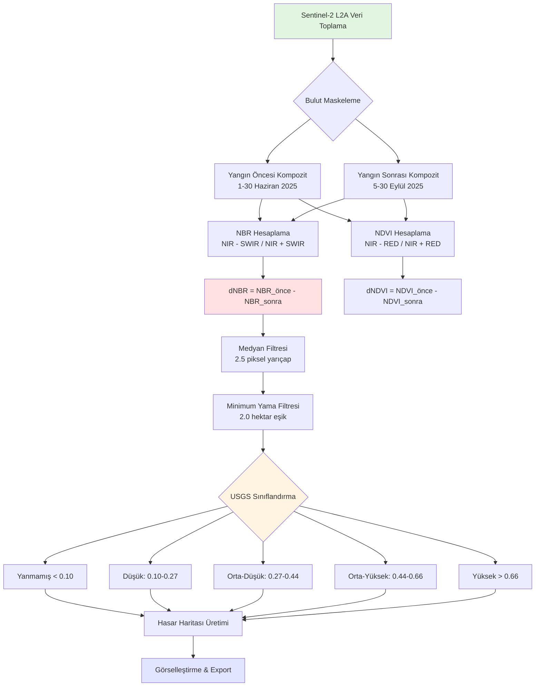

# TEKNİK YÖNTEM VE ALGORİTMALAR

> 📍 **Navigasyon:** [Ana Sayfa](../README.md) | [Haber Arşivi](YANGIN_HABER_ARSIVI.md) | [Geliştirici Notları](GELISTIRICI_NOTLARI.md)

---

## 📑 İçindekiler

1. [Veri Kaynağı: Sentinel-2](#1-veri-kaynağı-sentinel-2)
2. [Spektral İndeksler](#2-spektral-i̇ndeksler)
3. [Değişim Analizi ve Sınıflandırma](#3-değişim-analizi-ve-sınıflandırma)
4. [Gürültü Azaltma ve İyileştirme](#4-gürültü-azaltma-ve-i̇yileştirme)
5. [Metodoloji Akış Şeması](#5-metodoloji-akış-şeması)
6. [İlgili Kaynaklar](#6-i̇lgili-kaynaklar)

---

## 📖 Giriş

Bu proje, 2025 Karabük orman yangınlarının etkilerini uzaktan algılama teknikleri kullanarak nicel olarak analiz eder. Analizler **Google Earth Engine (GEE)** platformu üzerinde, **Sentinel-2 (MultiSpectral Instrument)** uydu verileri kullanılarak gerçekleştirilmiştir.

> **💡 İlgili Dokümantasyon:**
> - Yangın olaylarının kronolojisi için: [YANGIN_HABER_ARSIVI.md](YANGIN_HABER_ARSIVI.md)
> - GEE implementasyon detayları için: [GELISTIRICI_NOTLARI.md](GELISTIRICI_NOTLARI.md)
> - Analiz kodu için: [analysis.ipynb](../analysis.ipynb)

---

## 1. Veri Kaynağı: Sentinel-2
Analizde **Sentinel-2 L2A** (Level-2A, Atmosferik Olarak Düzeltilmiş) veri seti kullanılmıştır.
*   **Mekansal Çözünürlük:** RGB ve NIR bantları için 10 metre.
*   **Spektral Çözünürlük:** Görünür ışıktan (VIS) kısa dalga kızılötesine (SWIR) kadar 13 bant.
*   **Analiz Dönemleri:**
    *   **Referans (Yangın Öncesi):** 1 Haziran 2025 - 30 Haziran 2025 (Sağlıklı vejetasyon).
    *   **Değerlendirme (Yangın Sonrası):** 5 Eylül 2025 - 30 Eylül 2025 (Yangın sonrası durum).

Geçiş mevsiminin etkilerini minimize etmek için geniş tarih aralıkları seçilmiş ve bulutsuz piksel kompozitleri (Cloud-Free Median Composite) oluşturulmuştur.

## 2. Spektral İndeksler
Yangın etkisini tespit etmek için iki temel indeks hesaplanmıştır:

### NBR (Normalized Burn Ratio)
Yanmış alanları tespit etmek için geliştirilmiş standart indekstir. Sağlıklı bitki örtüsü NIR bandında yüksek yansıtma yaparken, yanmış alanlar SWIR bandında yüksek yansıtma yapar.
$$ \text{NBR} = \frac{\text{NIR} - \text{SWIR}}{\text{NIR} + \text{SWIR}} $$

### NDVI (Normalized Difference Vegetation Index)
Genel bitki sağlığını ölçmek için kullanılır.
$$ \text{NDVI} = \frac{\text{NIR} - \text{RED}}{\text{NIR} + \text{RED}} $$

## 3. Değişim Analizi ve Sınıflandırma

Hasar tespiti için yangın öncesi ve sonrası indekslerin farkı (Delta) alınır:
$$ \text{dNBR} = \text{NBR}_{\text{önce}} - \text{NBR}_{\text{sonra}} $$

### USGS Yanma Şiddeti Sınıflandırması
Hesaplanan dNBR değerleri, Amerika Birleşik Devletleri Jeolojik Araştırmalar Kurumu (USGS) standartlarına göre 5 sınıfa ayrılır:

| Şiddet Sınıfı | dNBR Değer Aralığı | Açıklama |
| :--- | :--- | :--- |
| **Yanmamış** | < 0.10 | Değişim yok veya çok az (fenolojik değişim). |
| **Düşük Şiddet** | 0.10 – 0.27 | Üst örtüde hafif yanma, ağaçlar canlı kalabilir. |
| **Orta-Düşük** | 0.27 – 0.44 | Yer örtüsü yanmış, ağaç gövdelerinde hafif hasar. |
| **Orta-Yüksek** | 0.44 – 0.66 | Ağaç taçlarında (tepe) önemli yanma. |
| **Yüksek Şiddet** | > 0.66 | Tamamen yanmış, biyokütle kaybı yüksek. |

## 4. Gürültü Azaltma ve İyileştirme (Noise Reduction)
Uydu görüntülerindeki atmosferik etkiler veya tekil piksel hatalarını (salt-and-pepper noise) gidermek için analiz hattına (pipeline) gelişmiş filtreler eklenmiştir:

1.  **Medyan Yumuşatma (Smoothing):**
    *   Ham dNBR ve Severity haritaları üzerinde **2.5 piksel** yarıçaplı medyan/mod filtresi uygulanır.
    *   Bu işlem, izole pikselleri komşularına benzeterek daha homojen ve yorumlanabilir "yanık lekeleri" oluşturur.

2.  **Minimum Yama Büyüklüğü (Minimum Patch Size):**
    *   Gerçek bir orman yangını belirli bir alana yayılır. Tek bir pikselin değişimi genellikle hatadır.
    *   Analizde, **2.0 Hektar**'dan küçük olan izole yanmış alanlar **filtrelenerek haritadan atılır**.
    *   Bölgesel (Zoom) analizlerde bu eşik daha hassas (0.1 hektar) tutulur.

3.  **İl Geneli Tarama Stratejisi:**
    *   Tüm Karabük ilini içeren büyük analizde bellek yönetimi kritik öneme sahiptir.
    *   Bu nedenle 1. Aşama taraması **100 metre** ölçeğinde (scale) yapılır.
    *   Daha sonra tespit edilen odak bölgelerde analiz **10 metre** (tam çözünürlük) ölçeğine indirilir.

---

## 5. Metodoloji Akış Şeması

Aşağıdaki diyagram, yangın analizi sürecinin adım adım akışını göstermektedir:

---

## 6. Sentinel-2 Bant Yapısı

Analizde kullanılan Sentinel-2 L2A bantlarının özellikleri:

| Bant Adı | Dalga Boyu (nm) | Çözünürlük (m) | Kullanım Amacı |
| :--- | :---: | :---: | :--- |
| **B2 (Blue)** | 490 | 10 | Atmosferik düzeltme, su kütleleri |
| **B3 (Green)** | 560 | 10 | Vejetasyon sağlığı, klorofil |
| **B4 (Red)** | 665 | 10 | NDVI hesaplama, bitki stresi |
| **B8 (NIR)** | 842 | 10 | NBR ve NDVI hesaplama (sağlıklı bitki yüksek yansıtma) |
| **B11 (SWIR-1)** | 1610 | 20 | Nem içeriği, yanmış alan tespiti |
| **B12 (SWIR-2)** | 2190 | 20 | NBR hesaplama (yanmış alan yüksek yansıtma) |

> **📌 Not:** SWIR bantları (B11, B12) 20m çözünürlükte olduğu için, analizde 10m'ye yeniden örneklenir (resample).

---

## 7. İlgili Kaynaklar

### Akademik Referanslar
- **USGS Burn Severity Standards:** [https://www.usgs.gov/landsat-missions/landsat-normalized-burn-ratio](https://www.usgs.gov/landsat-missions/landsat-normalized-burn-ratio)
- **Sentinel-2 User Handbook:** ESA Technical Guide
- **Google Earth Engine Documentation:** [https://developers.google.com/earth-engine](https://developers.google.com/earth-engine)

### Proje İçi Bağlantılar
- 📊 **Analiz Sonuçları:** [../sonuclar/](../sonuclar/)
- 🎓 **Akademik Rapor:** [../rapor/rapor.pdf](../rapor/rapor.pdf)
- 💻 **Kaynak Kod:** [../analysis.ipynb](../analysis.ipynb)
- 📰 **Yangın Kronolojisi:** [YANGIN_HABER_ARSIVI.md](YANGIN_HABER_ARSIVI.md)
- 🛠️ **Implementasyon Notları:** [GELISTIRICI_NOTLARI.md](GELISTIRICI_NOTLARI.md)

---

> 📍 **Navigasyon:** [Ana Sayfa](../README.md) | [Haber Arşivi](YANGIN_HABER_ARSIVI.md) | [Geliştirici Notları](GELISTIRICI_NOTLARI.md)
