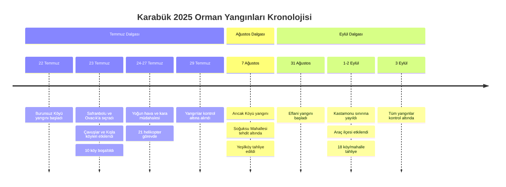

# YANGIN HABER ARŞİVİ

> 📍 **Navigasyon:** [Ana Sayfa](../README.md) | [Teknik Yöntem](TEKNIK_YONTEM.md) | [Geliştirici Notları](GELISTIRICI_NOTLARI.md)

---

## 📑 İçindekiler

1. [Giriş](#-giriş)
2. [Kronolojik Olay Özetleri](#-kronolojik-olay-özetleri)
3. [Yangın Zaman Çizelgesi](#-yangın-zaman-çizelgesi)
4. [Basına Yansıyan İstatistikler](#-basına-yansıyan-i̇statistikler)
5. [Resmi Açıklamalar ve Kamuoyu](#-resmi-açıklamalar-ve-kamuoyu)
6. [Kaynakça](#-kaynakça)
7. [İlgili Dokümantasyon](#-i̇lgili-dokümantasyon)

---

## 📖 Giriş

Bu belge, 2025 yılında Karabük'te meydana gelen orman yangınlarına dair **resmi açıklamalar, haber ajanslarının raporları ve kamuoyuna yansıyan detayları** kronolojik olarak derlemektedir. Projenin sayısal analizlerini tamamlayıcı nitelikteki bu "Sözel Veri Seti", yaşanan afetin boyutunu ve toplumsal etkisini anlamak için bir referans kaynağıdır.

> **💡 İlgili Analiz:**
> - Teknik metodoloji için: [TEKNIK_YONTEM.md](TEKNIK_YONTEM.md)
> - Uydu görüntüleri ile tespit edilen hasar haritaları: [../sonuclar/](../sonuclar/)
> - Akademik rapor: [../rapor/rapor.pdf](../rapor/rapor.pdf)

---

## 📅 Kronolojik Olay Özetleri

### 1. Temmuz Dalgası: Büyük Ovacık ve Safranbolu Yangınları
*Temmuz sonu, şiddetli rüzgar ve aşırı sıcakların etkisiyle başlayan en büyük yangın serisidir.*

*   **22 Temmuz 2025:** Merkez ilçeye bağlı Burunsuz Köyü mevkiinde ilk büyük yangın saat 16:32 sularında başladı. Ekiplerin hızlı müdahalesine rağmen rüzgarın etkisiyle alevler kısa sürede geniş bir alana yayıldı.
*   **23 Temmuz 2025:** Yangın Safranbolu ve Ovacık ilçelerine sıçradı. **Çavuşlar ve Kışla Köyleri** en çok etkilenen yerleşim yerleri oldu. Valilik kararıyla 10 köy tedbiren boşaltıldı.
*   **24-27 Temmuz 2025:** Müdahale havadan ve karadan yoğunlaştı. 21 helikopter ve yüzlerce personel alevlerle mücadele etti. Ovacık'ta bazı evlerin ve tarım arazilerinin zarar gördüğü bildirildi.
*   **29 Temmuz 2025:** Tarım ve Orman Bakanı İbrahim Yumaklı, yangınların büyük ölçüde kontrol altına alındığını ve soğutma çalışmalarının başladığını duyurdu.

### 2. Ağustos Dalgası: Arıcak ve Merkez Yangınları
*Merkez ilçeye yakın bölgelerde çıkan, yerleşim yerlerini tehdit eden yangınlardır.*

*   **7 Ağustos 2025:** Merkez Arıcak Köyü ve Soğuksu Mahallesi civarında yeni bir yangın başladı. Şehir merkezine yakınlığı nedeniyle panik yarattı.
*   **Müdahale:** Yeşilköy ve çevresindeki bazı evler tahliye edildi. Dumanlar şehir merkezini kapladı. Havadan yoğun müdahale ile büyümeden önlendi.

### 3. Eylül Dalgası: Eflani ve Sınır Yangınları
*Kuzey kesimlerde, Kastamonu sınırı boyunca etkili olan yangınlardır.*

*   **31 Ağustos - 2 Eylül 2025:** Eflani ilçesinde başlayan yangın, rüzgarla Kastamonu'nun Araç ilçesine (Güzelce Köyü) doğru ilerledi.
*   **Etkiler:** Eflani ve Araç arasında kalan ormanlık alanlar ve tarım arazileri zarar gördü. 18 köy/mahalle duman ve alev tehdidi nedeniyle tahliye edildi. Dumanların Ankara'ya kadar ulaştığı rapor edildi.
*   **3 Eylül 2025:** Eflani ve Toprakcuma bölgesindeki yangınlar tamamen kontrol altına alındı.

---

## 📅 Yangın Zaman Çizelgesi

Aşağıdaki diyagram, yangınların kronolojik gelişimini görsel olarak göstermektedir:

---

## 📊 Basına Yansıyan İstatistikler

Resmi kaynaklardan (OGM, Valilik) derlenen genel bilanço verileridir.

| Kategori | Açıklama |
| :--- | :--- |
| **Toplam Etkilenen Alan** | Yaklaşık **6.865 Hektar** (Resmi OGM 2025 Bilançosu). |
| **En Büyük Yangın** | Ovacık - Çavuşlar Yangını (Temmuz). |
| **Tahliye Edilen Kişi Sayısı** | 1.839 kişi (Valilik verisi). |
| **Hava Gücü** | 30 Helikopter, 5 Uçak (Dönemsel olarak görev aldı). |
| **Kara Gücü** | 855 Araç, 1.894 Personel. |
| **Can Kaybı** | İnsan can kaybı yaşanmadı. Doğal hayat ve yaban hayvanları olumsuz etkilendi. |

---

## 📢 Resmi Açıklamalar ve Kamuoyu

### Valilik ve Bakanlık
> *"Riskli günlerden geçiyoruz. Ekiplerimiz cansiperane mücadele ediyor. Vatandaşlarımızın uyarıları dikkate alması hayati önem taşıyor."* — **Tarım ve Orman Bakanı İbrahim Yumaklı**

> *"Safranbolu ve Ovacık'taki yangınlar nedeniyle risk altındaki köylerimizi ivedilikle boşalttık. Devletimiz tüm imkanlarıyla sahadadır."* — **Karabük Valisi Mustafa Yavuz**

### Toplumsal Yansımalar
*   Sosyal medyada **#KarabükYanıyor** etiketiyle binlerce yardım ve destek mesajı paylaşıldı.
*   Çevre illerden (Bolu, Kastamonu, Zonguldak) itfaiye ekipleri ve gönüllüler desteğe geldi.
*   Yangın sonrası bölgede kapsamlı bir ağaçlandırma ve erozyonla mücadele seferberliği başlatılacağı duyuruldu.

---

## 🔗 Kaynakça
*Bu arşivdeki bilgiler aşağıdaki açık kaynaklardan derlenmiştir:*
1.  Karabük Valiliği Resmi Basın Duyuruları (2025).
2.  Orman Genel Müdürlüğü (OGM) Yangın Bilgilendirme Sistemi.
3.  Anadolu Ajansı (AA) ve Yerel Medya Haberleri (Temmuz - Eylül 2025).
4.  TRT Haber "Karabük Yangınları" Dosyası.

---

## 🔗 İlgili Dokümantasyon

### Teknik Analizler
- 📊 **Hasar Haritaları:** [../sonuclar/](../sonuclar/) - Her yangın bölgesi için dNBR haritaları
- 🎓 **Akademik Rapor:** [../rapor/rapor.pdf](../rapor/rapor.pdf) - Bulgular ve değerlendirme
- 🔬 **Metodoloji:** [TEKNIK_YONTEM.md](TEKNIK_YONTEM.md) - NBR/NDVI hesaplama yöntemleri
- 💻 **Kaynak Kod:** [../analysis.ipynb](../analysis.ipynb) - GEE Python analiz notebook'u

### Geliştirme Notları
- 🛠️ **Teknik Zorluklar:** [GELISTIRICI_NOTLARI.md](GELISTIRICI_NOTLARI.md) - GEE API limitleri ve çözümler

---

> 📍 **Navigasyon:** [Ana Sayfa](../README.md) | [Teknik Yöntem](TEKNIK_YONTEM.md) | [Geliştirici Notları](GELISTIRICI_NOTLARI.md)
